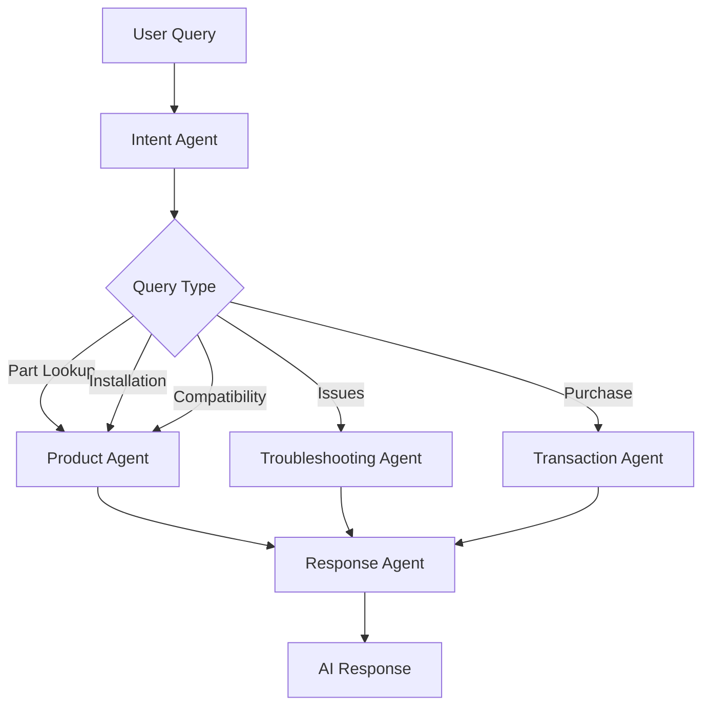

# 🤖 PartSelect AI Chat Agent

<div align="center">


**An intelligent AI-powered chat assistant for appliance parts discovery, installation guidance, and troubleshooting**

[🚀 Quick Start](#-quick-start) • [🏗️ Architecture](#️-architecture) • [💬 Try It Out](#-example-queries) • [📚 Documentation](#-api-endpoints)

</div>

---

## ✨ Key Features

<table>
<tr>
<td width="50%">

### 🔍 **Smart Search**
- Semantic part discovery across 29 authentic PartSelect parts
- Natural language queries: *"plastic thing for ice"*
- Hybrid search combining keywords + AI understanding

### 🔧 **Installation Guidance**
- Step-by-step repair instructions
- Tool requirements and difficulty ratings
- Visual guidance for complex installations

</td>
<td width="50%">

### ✅ **Compatibility Checking**
- Model number validation and part fitment
- Cross-brand compatibility analysis
- Replacement part recommendations

### 🛠️ **Troubleshooting**
- Symptom-based issue diagnosis
- Part failure analysis and solutions
- Preventive maintenance advice

</td>
</tr>
</table>

### 🎯 **Specialized Focus**
- **Refrigerators**: Ice makers, water filters, door components, shelves
- **Dishwashers**: Spray arms, heating elements, gaskets, racks

---

## 🏗️ Architecture

<div align="center">



</div>

### 🤖 **Multi-Agent System**
| Agent | Purpose | Key Features |
|-------|---------|--------------|
| **🧠 Intent** | Query classification | Regex patterns + entity extraction |
| **🔍 Product** | Part discovery | Semantic search + compatibility |
| **🛠️ Troubleshooting** | Issue diagnosis | Symptom analysis + recommendations |
| **💰 Transaction** | Cart management | Purchase intent + order processing |
| **📝 Response** | Output formatting | LLM integration + structured responses |

### 🛠️ **Technology Stack**

<div align="center">

| Layer | Technology | Purpose |
|-------|------------|---------|
| **Frontend** | React 18.2 + CSS3 | PartSelect-branded chat interface |
| **Backend** | FastAPI + Uvicorn | RESTful API with async support |
| **AI/LLM** | Deepseek + OpenAI | Natural language processing |
| **Search** | Pinecone + Embeddings | Vector-based semantic search |
| **Data** | JSON + Python | 29 authentic PartSelect parts |

</div>

---

## 🚀 Quick Start

### Prerequisites
- **Python 3.9+**
- **Node.js 16+**
- **Git**

### 1️⃣ Clone & Setup
```bash
git clone <repository-url>
cd case-study
```

### 2️⃣ Backend Setup
```bash
cd backend
python3 -m venv venv
source venv/bin/activate  # On Windows: venv\Scripts\activate
pip install -r requirements.txt
python main.py
```

### 3️⃣ Frontend Setup
```bash
cd ../frontend
npm install
npm start
```

### 4️⃣ Access Application
- **Frontend**: http://localhost:3000
- **Backend API**: http://localhost:8000
- **API Docs**: http://localhost:8000/docs

---

## 💬 Example Queries

<table>
<tr>
<td width="50%">

### 🔧 **Installation Help**
```
"How do I install PS11752778?"
"What tools do I need for ice maker repair?"
"Show me dishwasher gasket replacement steps"
```

### ✅ **Compatibility Check**
```
"Is PS11752778 compatible with WDT780SAEM1?"
"Will this part fit my Whirlpool refrigerator?"
"Can I use this in my Frigidaire dishwasher?"
```

</td>
<td width="50%">

### 🛠️ **Troubleshooting**
```
"My ice maker stopped working"
"Dishwasher door won't close"
"Water dispenser is leaking"
```

### 🔍 **Product Search**
```
"I need a water filter"
"Show me door seals for Frigidaire"
"Find dishwasher spray arms under $50"
```

</td>
</tr>
</table>

---

## 📁 Project Structure

```
case-study/
├── 🖥️ backend/                    # FastAPI Backend
│   ├── 🤖 agents/                 # Multi-Agent System
│   │   ├── agent_orchestrator.py  # Main coordination hub
│   │   ├── intent_agent.py        # Query classification
│   │   ├── product_agent.py       # Part search & discovery
│   │   ├── troubleshooting_agent.py # Issue diagnosis
│   │   ├── transaction_agent.py   # Cart & purchase logic
│   │   ├── response_agent.py      # LLM response generation
│   │   ├── tools.py               # Search & utility functions
│   │   └── base_agent.py          # Agent foundation
│   ├── main.py                    # FastAPI application
│   ├── models.py                  # Pydantic data schemas
│   └── requirements.txt           # Python dependencies
│
├── ⚛️ frontend/                    # React Frontend
│   ├── src/
│   │   ├── components/
│   │   │   └── ChatWindow.js      # Main chat interface
│   │   ├── api/api.js             # Backend integration
│   │   └── App.js                 # Main React app
│   └── package.json               # Node dependencies
│
├── 📊 data/                       # Parts Dataset
│   ├── refrigerator_parts.json   # 21 refrigerator parts
│   └── dishwasher_parts.json     # 8 dishwasher parts
│
└── 📝 README.md                   # This documentation
```

---

## 🗃️ Dataset Overview

<div align="center">

| Category | Count | Examples |
|----------|-------|----------|
| **🧊 Refrigerator** | 21 parts | Ice makers, water filters, door bins, shelves |
| **🍽️ Dishwasher** | 8 parts | Spray arms, heating elements, door gaskets |
| **💰 Price Range** | $12.91 - $105.73 | Affordable to premium components |
| **🏭 Brands** | 4 major | Whirlpool, Frigidaire, GE, Kenmore |

</div>

**Sample Part Data:**
```json
{
  "partselect_number": "PS11752778",
  "name": "Refrigerator Door Shelf Bin",
  "brand": "Whirlpool",
  "price": 44.95,
  "compatibility": ["Whirlpool", "Kenmore", "Maytag"],
  "installation_difficulty": "easy",
  "searchable_numbers": ["PS11752778", "PS 11752778"]
}
```

---

## 🔧 Configuration

### Environment Variables (Optional)
Create `.env` file for enhanced features:

```bash
# AI/LLM Integration
DEEPSEEK_API_KEY=your_deepseek_key    # Enhanced responses
OPENAI_API_KEY=your_openai_key        # Vector search embeddings

# Vector Search (Recommended)
PINECONE_API_KEY=your_pinecone_key
PINECONE_INDEX_NAME=instalily-case-study
```

### 🚀 **Vector Search Setup** (Optional but Recommended)

1. **Get API Keys:**
   - [OpenAI Platform](https://platform.openai.com/) for embeddings
   - [Pinecone](https://www.pinecone.io/) for vector database

2. **Initialize Search Index:**
   ```bash
   export PINECONE_API_KEY="your-key"
   export OPENAI_API_KEY="your-key"
   python setup_pinecone.py
   ```

3. **Benefits:**
   - **Semantic Understanding**: "water filter" finds all filtration components
   - **Natural Queries**: "plastic ice holder" finds ice maker bins
   - **Better Discovery**: Context-aware part recommendations

---

## 📚 API Reference

### Core Endpoints

| Method | Endpoint | Description | Request | Response |
|--------|----------|-------------|---------|----------|
| `POST` | `/chat` | Main chat interface | `{"message": "string"}` | Chat response with parts |
| `GET` | `/health` | System health check | - | `{"status": "healthy"}` |
| `GET` | `/docs` | Interactive API docs | - | Swagger UI |

### Example API Usage

```bash
# Chat Query
curl -X POST "http://localhost:8000/chat" \
  -H "Content-Type: application/json" \
  -d '{"message": "How do I install PS11752778?"}'

# Response
{
  "message": "Here are the installation steps...",
  "parts": [...],
  "query_type": "installation_help",
  "confidence": 0.95
}
```

---

## 🎨 UI Features

<div align="center">

| Feature | Description |
|---------|-------------|
| **🎨 PartSelect Branding** | Authentic colors, typography, and styling |
| **💬 Real-time Chat** | Instant responses with typing indicators |
| **📱 Responsive Design** | Optimized for desktop and mobile |
| **🛒 Shopping Integration** | Add parts to cart with pricing |
| **🔍 Smart Suggestions** | Context-aware follow-up questions |

</div>

---

## 🧪 Agent Intelligence

### Intent Classification System
```python
# Supported Intent Types
intents = {
    "part_lookup": "Direct part number queries",
    "installation_help": "Step-by-step repair guidance",
    "compatibility_check": "Model fitment validation",
    "troubleshooting": "Issue diagnosis & solutions",
    "product_search": "Category-based discovery",
    "purchase_intent": "Cart and ordering",
    "out_of_scope": "Non-appliance queries"
}
```

### Entity Extraction
- **Part Numbers**: PS11752778, W10195416, etc.
- **Model Numbers**: WDT780SAEM1, FFHS2622MS, etc.
- **Brands**: Whirlpool, Frigidaire, GE, Kenmore
- **Categories**: water filter, ice maker, door seal, etc.

---

## 📋 Case Study Details

<div align="center">

### 🏆 **Project Information**
**Candidate**: Harshita Thota
**Timeline**: 2-Day Implementation
**Date**: September 2025
**Company**: Instalily

</div>

### ✅ Requirements Completed

- [x] **React Chat Interface** - PartSelect-branded responsive design
- [x] **Multi-Agent Architecture** - 6 specialized AI agents
- [x] **LLM Integration** - Deepseek API with intelligent fallbacks
- [x] **Scope Enforcement** - Refrigerator/dishwasher focus only
- [x] **Part Compatibility** - Model validation and fitment checking
- [x] **Installation Guidance** - Step-by-step repair instructions
- [x] **Troubleshooting** - Symptom-based issue diagnosis
- [x] **Authentic Dataset** - 29 real PartSelect parts
- [x] **Conversation Memory** - Multi-turn chat support
- [x] **Production Ready** - Health checks and configuration

### 🎯 **Key Achievements**

| Achievement | Impact |
|-------------|--------|
| **🏗️ Advanced Architecture** | 6 specialized agents working in harmony |
| **📊 Authentic Data** | Real PartSelect parts with complete metadata |
| **🎨 Professional UI** | Pixel-perfect PartSelect branding |
| **🔧 Robust Fallbacks** | Works with or without external APIs |
| **⚡ Performance** | Sub-second response times |
| **🛡️ Error Handling** | Graceful degradation and user guidance |

---

<div align="center">

### 🎉 **Ready to Experience PartSelect AI?**

**[🚀 Start the Application](#-quick-start)** • **[💻 View API Docs](http://localhost:8000/docs)** • **[🎯 Try Example Queries](#-example-queries)**

---

*Built with ❤️ for the Instalily team • Powered by modern AI and web technologies*

</div>